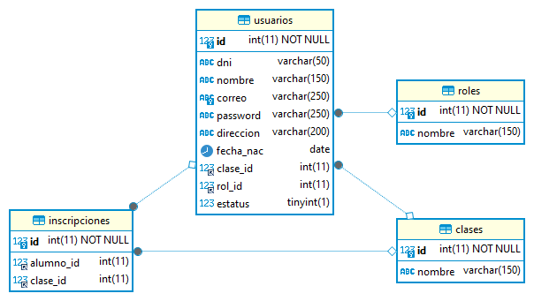
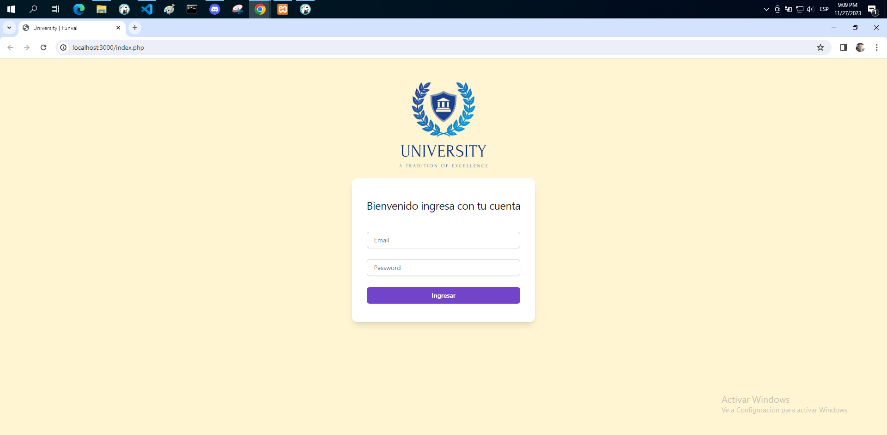
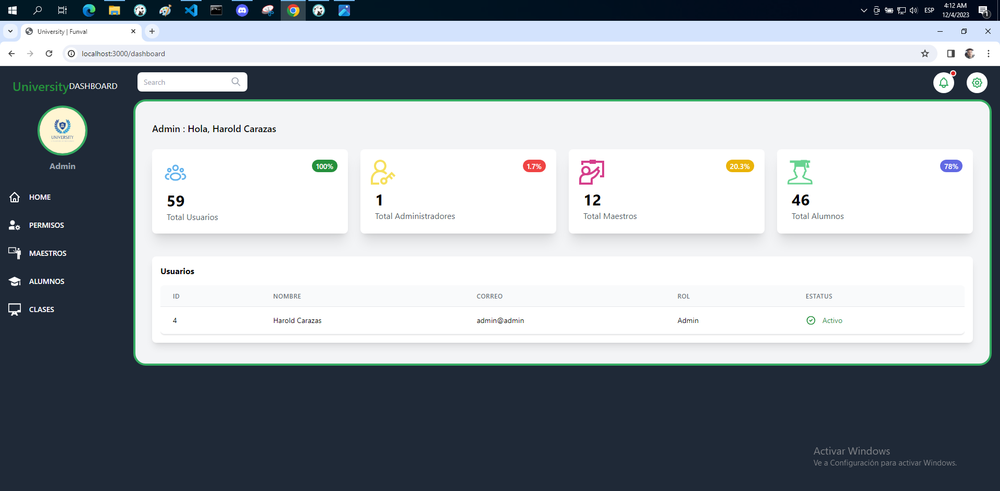
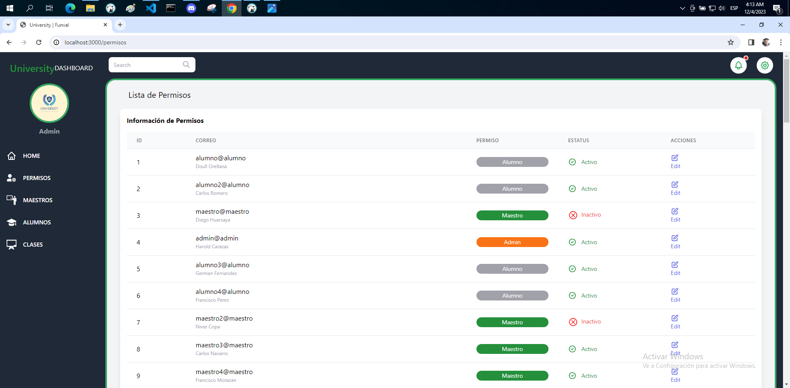
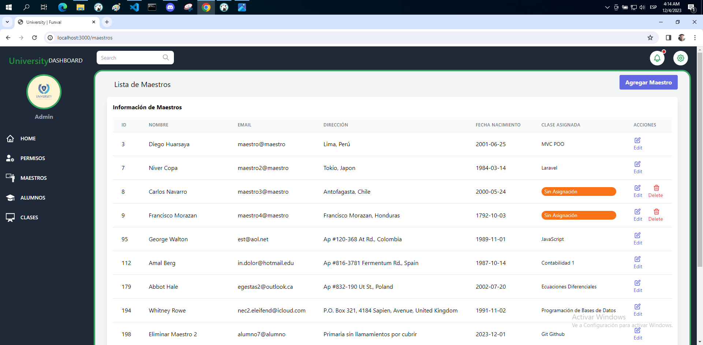
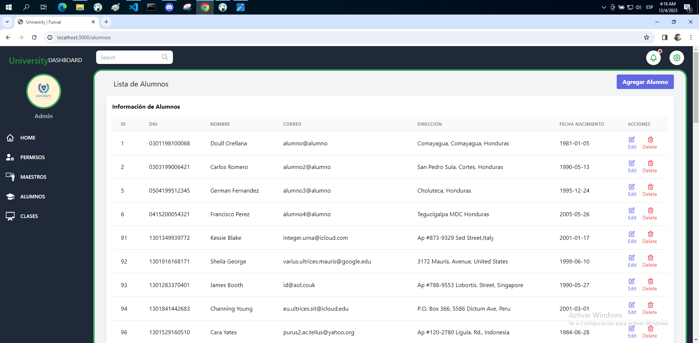

# Instrucciones

Bienvenido al proyecto final del nivel 3. En este proyecto estaremos aplicando los conocimientos adquiridos a lo largo del nivel. Sigue las instrucciones de este archivo para completar el proyecto y ten en cuenta que estas mismas se tomarán en cuenta para la evaluación final del proyecto.

## Instrucciones generales

Existe una universidad que desea crear su plataforma virtual. El diseño de la página web no está terminado, pero existen algunas vistas que podrían servir de referencia que vamos a dejarte en este repositorio. Según las instrucciones que el cliente nos ha dado, te daré las indicaciones necesarias para completar el proyecto.

## Instrucciones del proyecto

Para este proyecto, debes crear una plataforma con sistema de roles. Existen tres en específico: admin, maestro y alumno. Cada uno tendrá las siguientes funcionalidades:

### ADMIN

- Crear, Leer, Actualizar y Eliminar registros de maestros (CRUD).
- Crear, Leer, Actualizar y Eliminar registros de alumnos (CRUD).
- Crear, Leer, Actualizar y Eliminar clases/materias/cursos registrados (CRUD).
- Relacionar un maestro a un curso (o más, si gustas).
- Eliminar maestros no requiere que dicho maestro no tenga cursos asignados, se puede eliminar un maestro sin necesidad de dicha corroboración.
- Cambiar el rol de cada usuario (no se permite crear nuevos roles).

### MAESTRO

- Ver la clase a la que como maestro está asignado.
- Ver los datos de sus alumnos.

### ALUMNO

- Ver y cambiar las clases en las que está registrado.

## Archivos proporcionados en este repositorio

En este repositorio te hemos dado los siguientes archivos:

- En la carpeta `assets` encontrarás un archivo llamado `logo.jpg` el cual es el logo de la universidad en cuestión.
- En la carpeta `design` encontrarás tres carpetas: `admin`, `alumno` y `maestro`. En cada una se encuentran las respectivas capturas de pantalla que ilustran la funcionalidad del proyecto. Recuerda que <b>NO</b> es 100% obligatorio utilizar el mismo diseño. Sin embargo, debes aún **respetar la funcionalidad y los colores del logo que te hemos proporcionado**.

## Consideraciones para la calificación

A continuación te presentaremos los requerimientos que se tomarán en cuenta para la calificacion del proyecto, así como sus respectivos puntajes.

Tenemos 5 categorías a calificar:

### Interfaz de Usuario (UI) - 12 puntos

| Requerimiento                                                                          | Valor (puntaje) |
| :------------------------------------------------------------------------------------- | :-------------: |
| El proyecto ha sido realizado con Tailwind CSS.                                        |        3        |
| Instaló Tailwind CSS por medio de CLI.                                                 |        3        |
| La interfaz del usuario (UI) tiene el logo de la universidad.                          |        3        |
| Respetar los colores del logo de la universidad o buscar otros que combinen con estos. |        3        |
| Total                                                                                  |    12 puntos    |

### Rol: Admin - 49 puntos

| Requerimiento                             | Valor (puntaje) |
| :---------------------------------------- | :-------------: |
| Crear registros de maestros (CRUD).       |        4        |
| Leer registros de maestros (CRUD).        |        3        |
| Actualizar registros de maestros (CRUD).  |        4        |
| Eliminar registros de maestros (CRUD).    |        3        |
| Crear registros de alumnos (CRUD).        |        4        |
| Leer registros de alumnos (CRUD).         |        3        |
| Actualizar registros de alumnos (CRUD).   |        4        |
| Eliminar registros de alumnos (CRUD).     |        3        |
| Crear materias (CRUD).                    |        4        |
| Leer materias (CRUD).                     |        3        |
| Actualizar materias (CRUD).               |        4        |
| Eliminar materias (CRUD).                 |        3        |
| Relacionar un maestro a un curso (o más). |        4        |
| Cambiar el rol de cada usuario.           |        3        |
| Total                                     |    49 puntos    |

### Rol: Maestro - 8 puntos

| Requerimiento                                     | Valor (puntaje) |
| :------------------------------------------------ | :-------------: |
| Ver la clase a la que como maestro está asignado. |        4        |
| Ver los datos de sus alumnos.                     |        4        |
| Total                                             |    8 puntos     |

### Rol: Alumno - 4 puntos

| Requerimiento                                        | Valor (puntaje) |
| :--------------------------------------------------- | :-------------: |
| Ver y cambiar las clases en las que está registrado. |        4        |
| Total                                                |    4 puntos     |

### Estructura del proyecto - 27 puntos

| Requerimiento                                                      | Valor (puntaje) |
| :----------------------------------------------------------------- | :-------------: |
| MVC y POO.                                                         |       15        |
| Usó llaves foráneas en la base de datos                            |       10        |
| El archivo index.php se encuentra en la carpeta raíz del proyecto. |        2        |
| Total                                                              |    27 puntos    |

### Diagrama ER de la BDD

### Pantalla - Login Responsiva

### Panel Administrativo - Home Responsivo

### Panel Administrativo - Permisos de Usuario Responsivo

### Panel Administrativo - Maestros Responsivo

### Panel Administrativo - Alumnos Responsivo

### Panel Administrativo - Clases Responsivo

## ACUMULADO DE CATEGORÍAS

| Categoría                | Valor (puntaje) |
| :----------------------- | :-------------: |
| Interfaz de Usuario (UI) |       12        |
| Rol: Admin               |       49        |
| Rol: Maestro             |        8        |
| Rol: Alumno              |        4        |
| Estructura del proyecto  |       27        |
| Total                    |   100 puntos    |

## Consideraciones OPCIONALES que suman puntos:

- El diseño debe ser 100% responsive.
- Activar o desactivar a un usuario en el panel de administrador (quiere decir que si un usuario ha sido desactivado, no debería poder acceder con sus credenciales hasta que sea activado nuevamente).
- Las tablas tienen botones que permiten exportar los datos de las mismas en formato PDF, Excel, etc.
- Las tablas están paginadas.
- El admin puede ver la cantidad de alumnos inscritos en cada clase.
- Cada maestro puede Crear, Leer, Actualizar y Eliminar calificaciones y comentarios de sus alumnos.
- El alumno puede ver en la pestaña "Ver Calificaciones" un mensaje dejado por el maestro y la calificación de cada curso.
- Usar el plugin de Datatables (https://datatables.net/).
- Desarrollar toda la interfaz del usuario (UI) desde cero.
- Alguna otra funcionalidad acorde a la lógica del negocio.

Si existiesen requerimientos extras que se hayan realizado (de la lista de consideraciones opcionales o de tu propia iniciativa), debes dejar una nota en el archivo README.md de tu repositorio en GitHub que especifique cada una.
